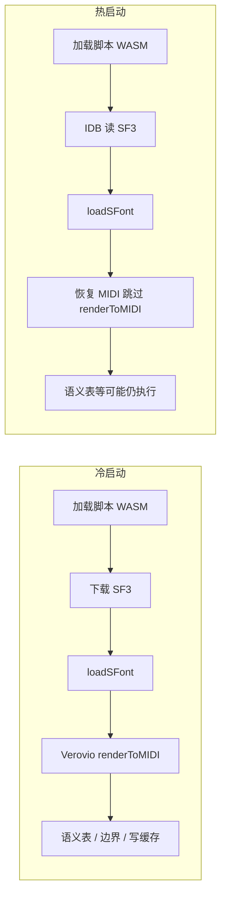

# 准备音色库：优化说明与性能测试

本文档记录「交响乐演奏 → 准备乐器音色库」功能的实现要点、已落地的本地缓存优化，以及以 **春之声** 乐谱为例的实测耗时（2026-05 前后版本）。

---

## 一、功能说明

用户点击侧栏 **「准备乐器音色库」** 后，应用会完成播放所需的基础数据准备，主要包括：

1. **音色库（SF3）**：加载 FluidSynth / js-synthesizer 脚本，下载或读取 SoundFont，初始化 Web 音频合成器。
2. **MIDI**：通过 Verovio 将当前乐谱 MusicXML 转为多轨 MIDI（base64），并解析总 tick、速度映射（tempo map）等。
3. **播放对齐数据**：构建或复用语义播放表（`semanticPlaybackRows`）、页/系统边界等，供播放光标与翻页指示使用。

准备完成后，`orchestraPlaybackReady` 为 true，可点击「播放 / 暂停 / 停止」。**准备本身不会开始播放**，仅加载资源与数据。

事件链路：`FileToolPanel.vue` 发出 `prepare-orchestra-playback` → `HomePage.vue` 的 `prepareOrchestraPlayback()`。

---

## 二、本地缓存架构（两套 IndexedDB）

| 数据库名 | 模块 | 缓存内容 |
|----------|------|----------|
| `five-line-staff-soundfont-cache` | `src/lib/soundfontCache.ts` | **仅 SF3** 二进制（按 URL 为 key） |
| `five-line-staff-cache` | `src/lib/scoreCache.ts` | 每份乐谱：SVG 页面、MusicXML、标注、语义播放表、页/系统边界等；**本次起增加 MIDI 相关字段** |

### 乐谱缓存中新增的 MIDI 字段

写入 `ScoreCacheRecord`，与 `cacheKey`（含文件 hash、渲染引擎、`layoutVersion`）绑定：

| 字段 | 说明 |
|------|------|
| `midiBase64` | Verovio `renderToMIDI()` 输出 |
| `midiTotalTicks` | 整首总 tick |
| `midiTotalMs` | 整首时长（毫秒，可选） |
| `midiTempoMap` | PPQ + tempo 事件（可选；缺失时可从 `midiBase64` 再解析） |

辅助 API：`normalizeScoreCacheMidiFields()`、`getScoreCacheMidiSnapshot()`。

---

## 三、已落地的优化

### 3.1 SF3 音色库缓存（既有能力）

- 首次从网络（或环境变量配置的 URL）下载 SF3，成功后写入 `five-line-staff-soundfont-cache`。
- 同 URL 再次准备时优先读 IndexedDB，避免重复下载（仍须将 SF3 **载入 FluidSynth 内存**，`loadSFont`）。
- 默认音色约 **82MB**（`MuseScore_General.sf3`），首次耗时与网速强相关。

### 3.2 MIDI 写入乐谱 IndexedDB（本次新增）

- **持久化**：`persistCurrentCacheState()`、打开乐谱时的 `putScoreCache()` 在内存中已有有效 MIDI 时，一并写入上述字段。
- **恢复**：`applyCachedState()` 从缓存读出 MIDI 快照，恢复到 `currentMidiBase64`、`currentMidiTotalTicks`、`midiTempoMap`、`currentMidiTotalMs`。
- **跳过重复生成**：`ensureCurrentMidiPrepared()` 若内存中已有 `midiBase64` 且 `midiTotalTicks > 0`，则**不再调用** Verovio `renderToMIDI()`（控制台可看到 `[ensure-midi]:reuse-memory-cache`）。

### 3.3 乐谱侧已有、与准备协同的数据

- `semanticPlaybackRows`、`pageBoundaryProgress`、`systemBoundaryProgressByPage` 等已在乐谱缓存中；从缓存打开乐谱时会恢复，减少部分对齐计算（本次未改语义表重建逻辑，准备流程仍可能执行 `rebuildSemanticPlaybackRows`）。

### 3.4 失效与边界

- 更换排版 / 引擎导致 `cacheKey` 变化时，旧 MIDI 缓存不自动沿用，需重新生成。
- 清空浏览器站点数据或删除乐谱缓存后，MIDI 与 SF3 缓存均失效。
- `orchestraPlaybackReady` 在换谱、恢复缓存、刷新页面后仍会清零；**每次新会话仍需完成音色库载入合成器**，无法仅靠 MIDI 缓存跳过 SF3 准备。

---

## 四、性能测试记录

### 4.1 测试条件

| 项 | 说明 |
|----|------|
| 乐谱 | **春之声**（项目内 MusicXML 测试谱） |
| 首次场景 | **清空所有本地缓存**后，从下载 SF3 开始完整准备 |
| 二次场景 | **刷新页面**后再次点击「准备乐器音色库」；此时 SF3 与 MIDI 均已命中本地缓存 |
| 网络 | 首次下载 SF3 耗时与网速相关（未固定带宽） |

### 4.2 实测结果

| 场景 | 操作 | 耗时（约） | 说明 |
|------|------|------------|------|
| 冷启动 | 清空缓存 → 首次「准备乐器音色库」 | **~120s** | 含 SF3 下载、脚本/WASM 加载、`loadSFont`、Verovio 生成 MIDI、语义/边界等；下载占比较大 |
| 热启动 | 刷新页面 → 再次「准备乐器音色库」 | **~17s** | SF3 从 IndexedDB 读取；MIDI 从乐谱缓存恢复，跳过 `renderToMIDI`；仍含合成器初始化、可能的 Verovio toolkit / 语义表重建等 |

### 4.3 结果解读

- **冷启动 ~120s**：主要瓶颈在 **SF3 首次下载（~82MB）** 与 **大谱 Verovio `renderToMIDI()`**；春之声体量较大时 MIDI 生成亦显著。
- **热启动 ~17s**：说明 **SF3 + MIDI 本地缓存有效**，较冷启动缩短约 **85%**；剩余时间主要来自：
  - 每会话仍将 SF3 载入 FluidSynth；
  - 加载 libfluidsynth / js-synthesizer；
  - 准备流程内仍可能执行的 Verovio toolkit 创建、`renderToTimemap` / `rebuildSemanticPlaybackRows` 等（后续可继续优化）。

---

## 五、准备流程耗时构成（参考）

| 阶段 | 冷启动 | 热启动（有缓存） |
|------|--------|------------------|
| SF3 | 网络下载 + 写 soundfont IDB | IDB 读取 + `loadSFont` |
| MIDI | Verovio 全量生成 | 从乐谱 IDB 恢复，跳过 `renderToMIDI` |
| 合成器 / 脚本 | 每次会话需要 | 每次会话需要 |
| 语义 / timemap | 通常执行 | 可能仍执行（未在本轮裁剪） |

---

## 六、相关源码索引

| 路径 | 职责 |
|------|------|
| `src/views/home-page/components/FileToolPanel.vue` | 「准备乐器音色库」按钮与准备进度 UI |
| `src/views/home-page/HomePage.vue` | `prepareOrchestraPlayback`、`ensureOrchestraPrepared`、`ensureCurrentMidiPrepared`、`applyCachedState`、`persistCurrentCacheState` |
| `src/lib/orchestraPlayer.ts` | FluidSynth 脚本加载、SF3 加载、`prepare()` |
| `src/lib/soundfontCache.ts` | SF3 IndexedDB |
| `src/lib/scoreCache.ts` | 乐谱 IndexedDB（含 MIDI 字段） |

---

## 七、后续可优化方向（未实现）

以下仅作记录，**不在本次改动范围内**：

1. 有 `semanticPlaybackRows` 且源 XML / layout 未变时，跳过重复的 `rebuildSemanticPlaybackRows`。
2. OSMD 显示模式下，避免每次准备都新建 Verovio fallback toolkit（仅在有缓存 MIDI 时延迟创建）。
3. 将「音色库已就绪」与会话级 `AudioContext` 生命周期结合，减少刷新后重复 `loadSFont` 的体感（需权衡内存与换谱清理）。
4. 准备进度条对接真实阶段（当前侧栏进度为基于 `playbackLoading` 的模拟动画）。

---

## 八、修订记录

| 日期 | 说明 |
|------|------|
| 2026-05-22 | 初版：MIDI 乐谱缓存落地；春之声冷/热启动耗时记录 |
